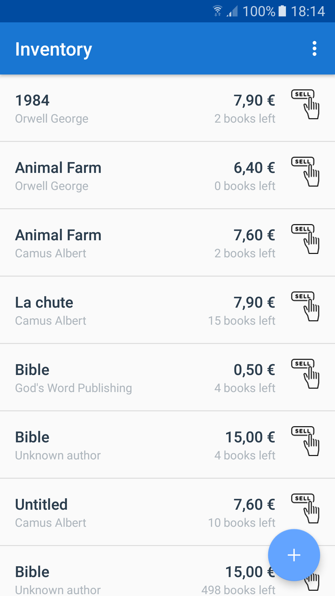
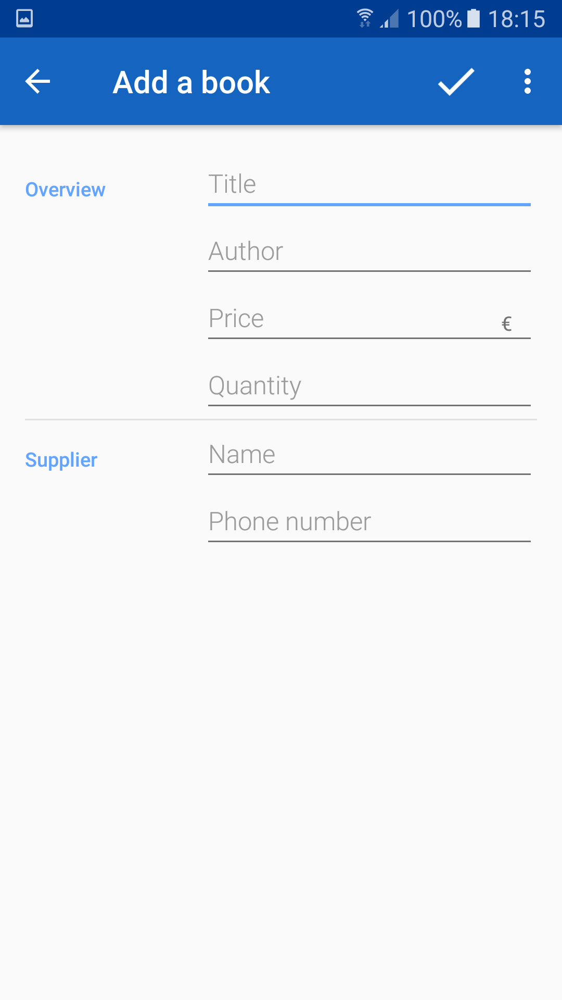
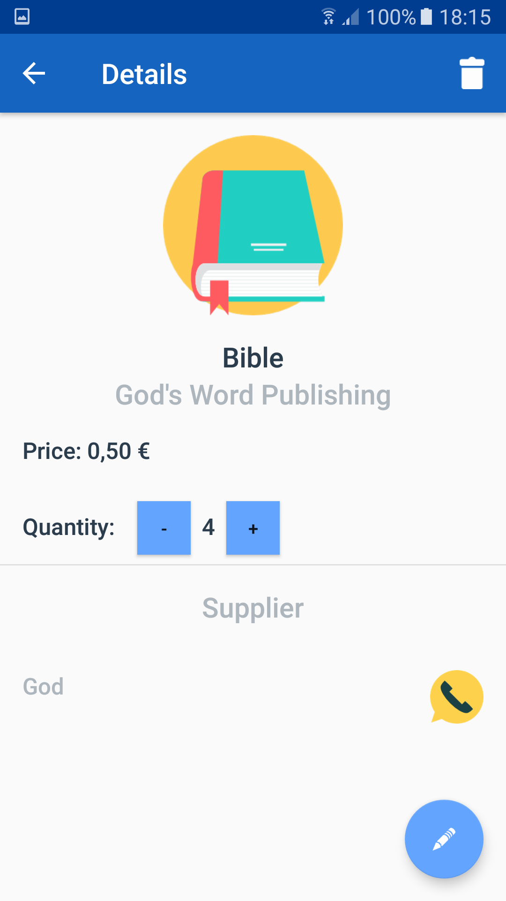
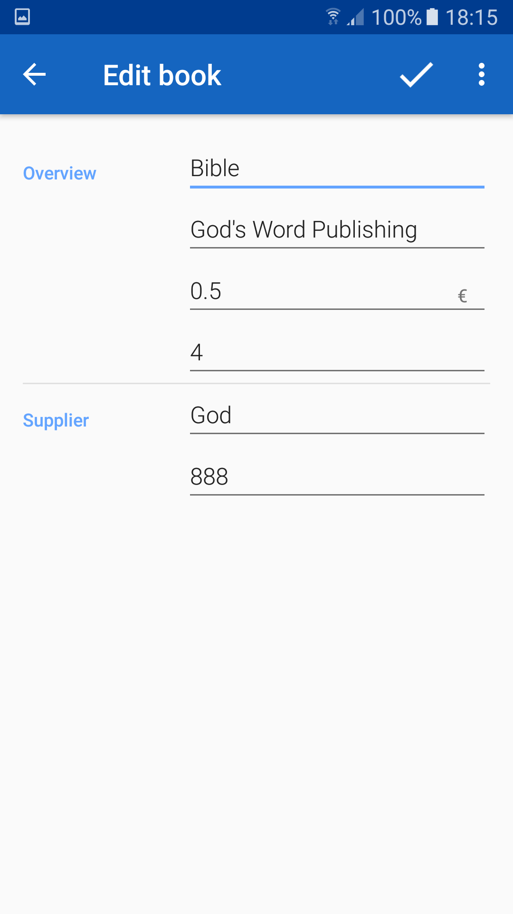

# Book Store App
Android App that keeps track of the Book Inventory of a Book store. Each book is catalogued in a DB with adiitional info (author, title, stock, price, supplier).The DB is customizable within the app.

### Prerequisites

Install the latest version of [Android Studio](https://developer.android.com/studio)

### Installing

Download the files and open the project from within [Android Studio](https://developer.android.com/studio).

## Built With

* [Android Studio](https://developer.android.com/studio) - The framework used

## Authors

* **Nikos Syrios** - [nikossyr](https://github.com/nikossyr)

## Screenshots

<table width="100%" border="0">
  <thead>
    <tr>
      <th align="center">Book Inventory</th>
      <th align="center">Adding a new book</th>
    </tr>
  </thead>
  <tbody>
    <tr>
      <td align="center"></td>
      <td align="center"></td>
    </tr>
   </tbody>
  </table>
  <table width="100%" border="0">
    <thead>
      <tr>
        <th align="center">Book details</th>  
        <th align="center">Edit book details</th>
      </tr>
    </thead>
  <tbody>
    <tr>
      <td align="center"></td>
      <td align="center"></td>
    </tr>
  </tbody>
</table>
